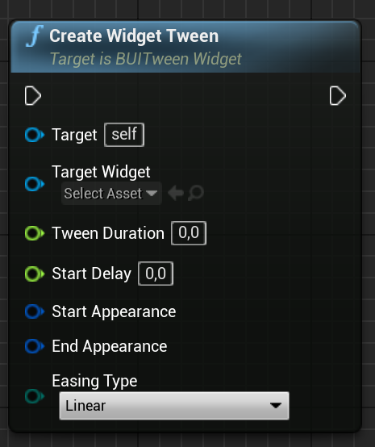
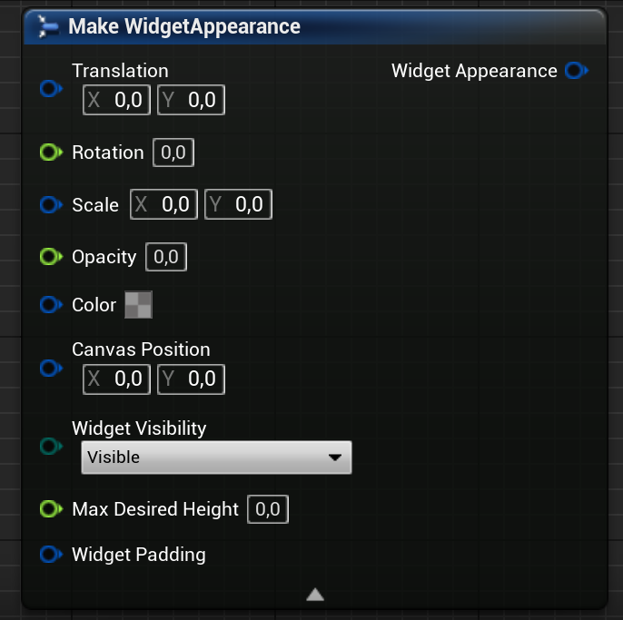

# UI Tweening Libary for UE4/UMG

Create simple tweens for UMG widgets from C++ and BP.

```cpp
UBUITween::Create( SomeWidget, 0.2f )
	.FromTranslation( FVector2D( -100, 0 ) )
	.FromOpacity( 0.2f )
	.ToTranslation( FVector2D( 20, 10 ) )
	.ToOpacity( 1.0f )
	.Begin();
```
## Compatible engine versions

The plugin was tested to work in 4.27. However, the functions are rather simple,
it is expected to work on at least far back as Unreal Engine 4.5.
It has yet been tested in Unreal Engine 5, but should also work right away without
much hassle.

## Why using code tweening and not the UMG timeline?

While UMG's timeline animator is serviceable for prototyping UI animations, or used
as is for fixed animations, it lacks the flexibility to animate more modular,
procedurally built widgets (e.g. Inventory list, commands menu, etc.).

## Usage in C++

The plugin module registers itself to tick automatically even during game-world
pause.

```cpp
// Make UWidget MyWidget fade in from the left
const float TweenDuration = 0.7f;
const float StartDelay = 0.3f;
UBUITween::Create( MyWidget, TweenDuration, StartDelay )
	.FromTranslation( FVector2D( -100, 0 ) )
	.FromOpacity( 0.2f )
	.ToReset()
	.Easing( EBUIEasingType::OutCubic )
	.Begin();
```

Parameters available:

| Property | From | To |
| --- | --- | --- |
| **Translation**         | `FromTranslation( FVector2D)`         | `ToTranslation( FVector2D )` |
| **Scale**               | `FromScale( FVector2D )`              | `ToScale( FVector2D )` |
| **Rotation**            | `FromRotation( float )`               | `ToRotation( float )` |
| **Opacity**             | `FromOpacity( float )`                | `ToOpacity( float )` |
| **Color**               | `FromColor( FLinearColor )`           | `ToColor( FLinearColor )` |
| **Visibility**          | `FromVisibility( ESlateVisibility )`  | `ToVisibility( ESlateVisibility )` |
| **Canvas Position**     | `FromCanvasPosition( FVector2D )`     | `ToCanvasPosition( FVector2D )` |
| **SizeBox Max Height**  | `FromMaxDesiredHeight( float )`       | `ToMaxDesiredHeight( float )` |
| **Slot Padding**        | `FromPadding( FMargin )`              | `ToPadding( FMargin )` |

Other helper functions:

* `ToReset()`

## Callbacks

```cpp
UBUITween::Create( MyWidget, 0.5f )
	.FromRotation( -90 )
	.ToRotation( 45 )
	.OnComplete( FBUITweenSignature::CreateLambda([]( UWidget* Owner ) {
		// Do some logic on complete
	} ) )
	.Begin();
```


For the full API, check the source code.

## Usage in Blueprints

(exposed to BP by TheHoodieGuy02)

To use the widget tweening functions in BP, simply reparent your widget BP to
BUITweenWidget class. This User Widget class exposes the Create Widget Tween
to Blueprint, and also provides a struct for the parameters that Create Widget
Tween needs.



- Target Widget is the widget that you want to apply the tween on.
Expects a Widget Object.

- Tween Duration is the duration for the tween to last, in seconds.
Expects float value.

- Start Delay is the length of for the tween pausing at the start point, before
interpolating to the end point.
Expects float value.

- Start Appearance is the start point parameter of the transforms.
Expects WidgetAppearance struct.

- End Appearance is the end point parameter of the transforms.
Expects WidgetAppearance struct.

- Easing Type is the interpolation type for the tween.
Expects BUI Easing Type enum.



The WidgetAppearance struct contains parameters that control how the widget appears in
the viewport. Some parameters only available to certain widget types, however, Create
Widget Tween function already do the casting and they'll be unused if the cast fails.

- Translation corresponds to the widget's render translation.
Widget type agnostic.

- Rotation corresponds to the widget's render rotation.
Widget type agnostic.

- Scale corresponds to the widget's render scale.
Widget type agnostic.

- Opacity corresponds to the widget's render opacity.
Widget type agnostic.

- Color corresponds to the widget's content color.
Applicable to User Widget, Image, and Border widgets.

- Canvas Position corresponds to the widget's position relative to Canvas Panel parent.
Applicable to widgets in a Canvas Panel.

- Widget Visibility corresponds to the widget's visibility type.
Widget type agnostic.

- Max Desired Height corresponds to the widget's desired height limit.
Applicable to Size Box widgets.

- Widget Padding corresponds to the widget's padding in flowing containers.
Applicable to widgets in an Overlay, Vertical Box, or Vertical Box.

## Caveats and Issues

For more updated list of issues, see the [Issues page](https://github.com/TheHoodieGuy02/UE4-UITween/issues).

## License

[CC0](https://creativecommons.org/publicdomain/zero/1.0/)

## Contact

If you find it useful, drop me a line [@_benui](https://twitter.com/_benui) on Twitter

[benui.ca](https://benui.ca)
